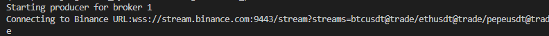

TICK SYSTEM -  README
An applicatio utilising django, celery, mysql and redis to consume live binance ticks and storing them into the database.

- How to bring up the stack:
    -> Build and start all service:
    docker-compose --build
    docker-compose up

    This launches:
    - Mysql
    - Redis
    - Django web server
    - Celery Worker
    - Tick producer service

 -> Apply migrations:
    docker-compose exec web python manage.py migrate

- Django admin login steps:
    - Creating superuser/Admin:
    docker-compose exec web python manage.py createsuperuser

    -> Enter the details as prompted

    Login to localhost:8000 or 127.0.0.1:8000 or 0.0.0.0:8000 

    Enter the username and password for the admin created
    - Remember to store password securely for future use

- Adding Broker + Scripts:
    - Brokers:
        - Inside django admin, go to Brokers
        - Add Broker type, name and apiconfig.
            * type = Binance Live
            * name=Binance
            * apiconfig ={}
        - Save
    - Scripts:
        - Inside django admin, go to Scripts
        - Select Broker, enter script name and its trading symbol.
            * Broker: Binance
            * name: bitcoin
            * trading symbol: btcusdt
    - The symbol will be automatically be subscribed as btcusdt@ticker

- Running the producer command:
    - Running the producer command:
    - To run producer manually, open the terminal and add:
        docker-compose exec web python manage.py run_tick_producer --broker_id=1

    - To verify , observe the logs:
        docker logs -f tick_producer

    - Expected output:
        

            OR

        Starting producer for broker 1
        Connecting to Binance URL:<Your binance url>

- Verify ticks into db:
    - Using MySQL container in docker:
        - Open MySQL container inside docker
            docker exec -t mysql mysql -u root -p
            root: <username>
            -p:<password>

        - USE tick_engine (your db name if you have changed the yaml file)
        - Query:
        SELECT *
        FROM tick_consumer_ticks
        ORDER BY id DESC
        LIMIT 10;

        You should see the entries.

            OR

    - Using admin panel:
        Head to admin panel and open the ticks table. Refresh to check regular tick entries 

    

